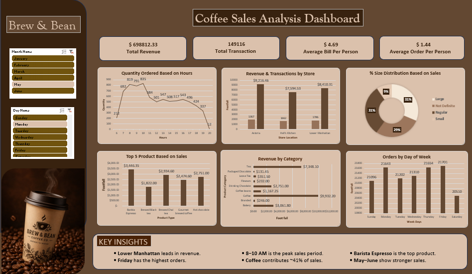

# ☕ Coffee Sales Analysis Dashboard

An interactive Coffee Sales Analysis Dashboard built in Microsoft Excel to evaluate sales performance across products, stores, categories, and time periods.

The project transforms raw coffee transaction data into a business-focused dashboard using PivotTables, PivotCharts, Excel formulas, KPIs, and interactive slicers.

---

## 🎯 Business Problem

The coffee business needs to understand its sales performance and identify

- Which stores generate the highest revenue
- Which products and categories contribute most to sales
- When are the peak sales hours
- Which days and months perform better
- How does sales performance fluctuate across locations and products

Objective Build an interactive dashboard that helps management make better decisions around inventory, staffing, promotions, and store performance.

---

## 🛠️ Tools & Skills

- Microsoft Excel
- Data Cleaning & Preparation
- Excel Formulas
- PivotTables & PivotCharts
- KPI Development
- Interactive Slicers
- Time-Based Analysis
- Sales Analysis
- Data Visualization
- Business Insights

---

## 🔄 Project Workflow

Raw Transaction Data  
        ↓  
Data Cleaning & Preparation  
        ↓  
Sales & Time-Based Calculations  
        ↓  
PivotTables  
        ↓  
PivotCharts + KPIs  
        ↓  
Interactive Slicers  
        ↓  
Dashboard  
        ↓  
Business Insights

---

## 📊 Dashboard Features

### Key Performance Indicators

 KPI  Value 
------
 Total Revenue  $698,812.33 
 Total Transactions  149,116 
 Average Bill  $4.69 
 Average Order  $1.44 

### Analysis Covered

- ⏰ Hourly quantityorder trends
- 🏪 Store-wise sales and footfall
- ☕ Product-level sales performance
- 📦 Category-wise sales contribution
- 📅 Weekday order analysis
- 📆 Monthly sales analysis
- 📈 Sales fluctuation analysis

---

## 🎛️ Interactive Filters

The dashboard includes interactive slicers for

- Month
- Day

The connected PivotTables, PivotCharts, and dashboard analysis update dynamically based on the selected filters.

---

## 📈 Key Business Insights

- Lower Manhattan leads in revenue among the analyzed locations.
- Friday records the highest number of orders.
- 8–10 AM is the peak sales period.
- Coffee contributes approximately 41% of total sales.
- Barista Espresso is the top-performing product.
- May–June show stronger sales performance.

---

## 💡 Business Recommendations

- Increase staffing and inventory during peak morning hours.     
- Focus promotions on weaker sales periods.     
- Maintain stock of high-performing products.       
- Use sales trends for better inventory and workforce planning.      

---

## 📷 Dashboard Preview

---

## 📌 Outcome

- Converted raw transaction data into actionable insights.      
- Identified top-performing stores, products, and categories.    
- Found peak sales hours and high-performing days/months.       
- Improved understanding of sales trends and customer demand.     
- Supported better decisions for staffing, inventory, and promotions.      
